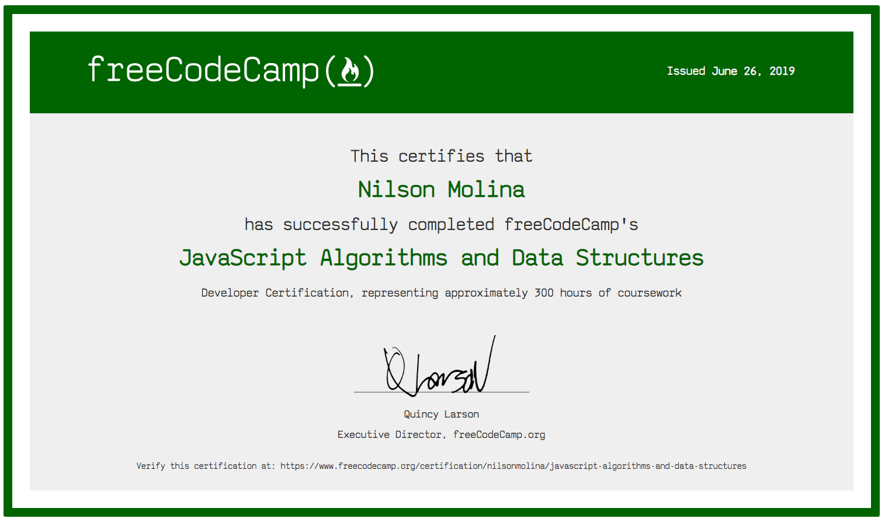

# FreeCodeCamp
<!-- **Site:** [https://www.ngsprices.ml](https://www.ngsprices.ml)   -->

A collection of projects and certificates from FreeCodeCamp.

---
## Javascript Algorithms And Data Structures Certification
This course went over the following topics:
- Basic Javascript
- ES6
- Regular Expression
- Debugging
- Basic Data Structures
- Basic Algorithm Scripting
- Object Oriented Programming
- Functional Programming
- Intermediate Algorithm Scripting

